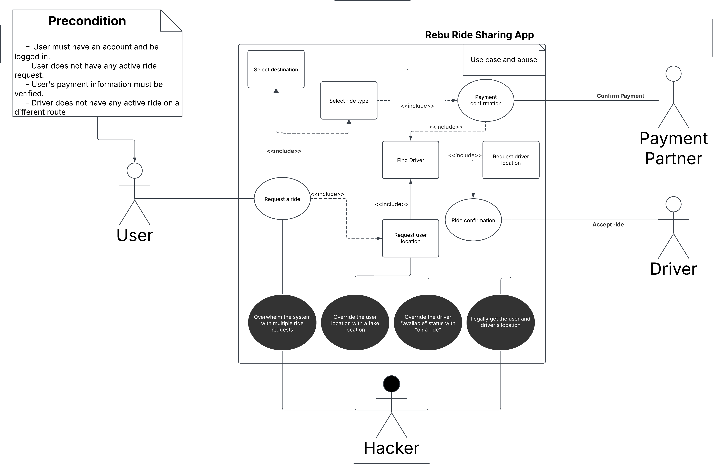
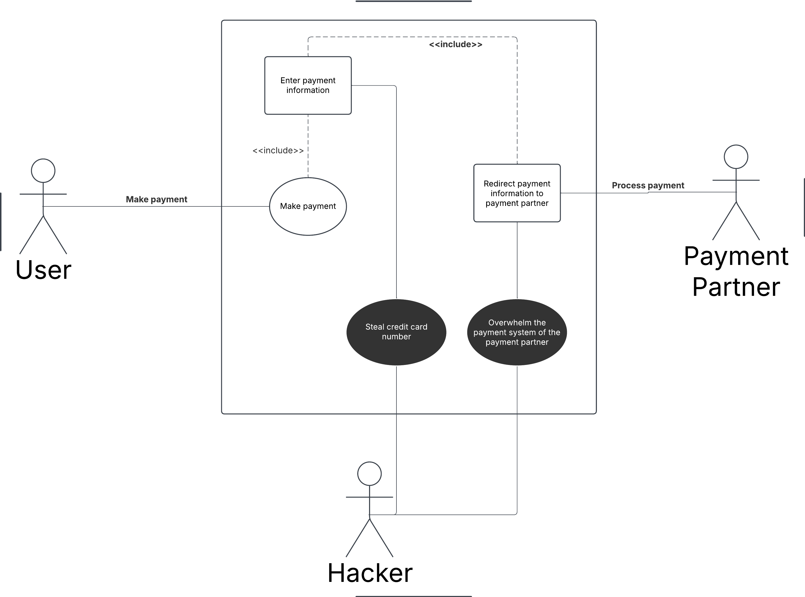
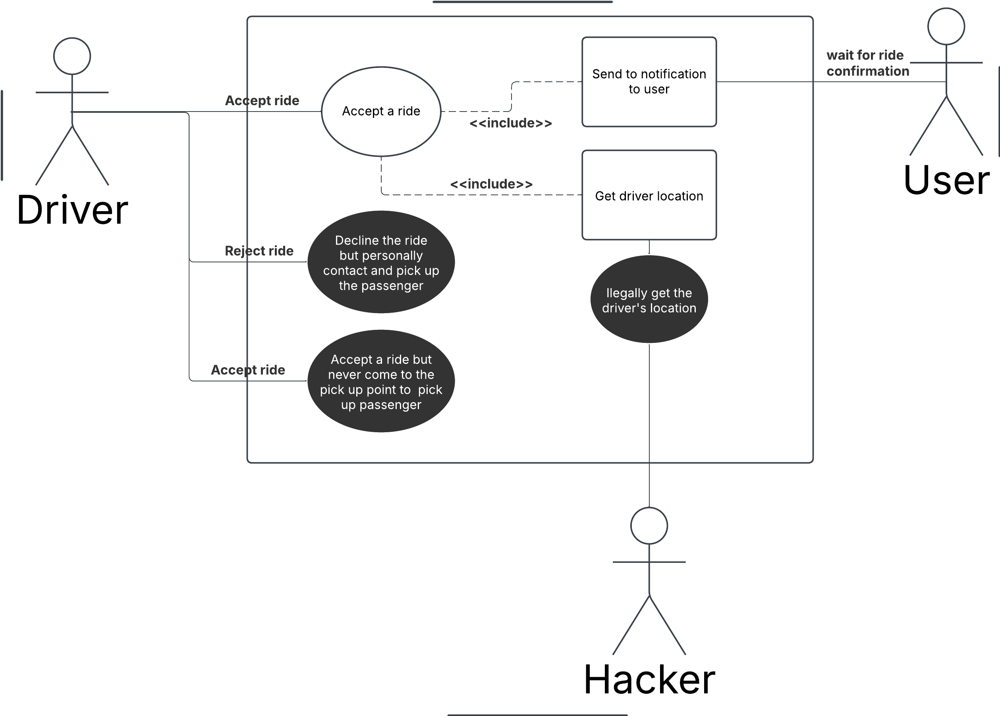

# Requirements Specification of Rebu

## Members:

-   Huy Vuong
-   Minh Nguyen
-   Vy Nguyen

## 1. Overview

### 1.1 Description

The Rebu app is a mobile application that allows users to request a ride from one location to another or share a ride with another users in the same direction. The app connects users with drivers who are available to provide transportation services. The app is designed to be user-friendly and convenient, providing a safe and reliable way for users to get to their destination.

### 1.2 Actors

-   User: The person who requests a ride using the Rebu app.
-   Driver: The person who provides transportation services using the Rebu app.
-   Payment Partner: The company that processes payments for the Rebu app.
-   Admin: The person who manages the Rebu app and its users.
-   Hacker: The person who tries to hack the Rebu app and its users.

### 1.3 Security Goals

-   System need to always update live location of the driver and user.
-   System should not be down/ Limit system downtime
-   User personal information should be secured (e.g. name, phone number, email address)
-   Driver identity should be verified based on government ID
-   Payment information should be secured (e.g. credit card information)

## 2. Use Cases

### 2.1 Use Cases

---

#### Use Case 1: Request a Ride

#### Actors:

-   User: Primary actor who initiates ride requests
-   Driver: Actor who receives and accepts ride requests
-   Payment Partner: Third-party system responsible for processing payments
-   Rebu system: The system that manages ride requests and driver assignments

---

#### Use Case 2: Make a Payment

#### Actors:

-   User
-   Payment Partner
-   Rebu system

---

#### Use Case 3: Accept a Ride

#### Actors:

-   Driver
-   Rebu system

---

### 2.2 Detailed Use Case

#### Use Case 1: Request a Ride

#### Precondition:

-   User must have an account and be logged in.
-   User does not have any active ride request.
-   User's payment information must be verified.
-   Driver does not have any active ride on a different route to the user's destination.

#### Main flow of events:

-   Passenger logins to the Rebu app.
-   Passenger select destination and pick-up location.
-   Passenger select ride type (solo or ride-share; SUV or sedan)
-   Passenger confirm the ride request.
-   Passenger wait for driver to accept the ride request.
-   Driver accept the ride request.
-   Passenger make a payment
-   Payment partner process the payment.
-   Payment partner notify Rebu system that the payment is successful.
-   Rebu system notify driver and passenger that the the ride request is accepted.

#### Information being exchanged:

-   Passenger's location and destination
-   Passenger's payment information
-   Driver's location and availability

#### Detailed UML usecase diagram:

### 2.3 Missused / Abuse case

#### Use Case 2: Make a Payment

#### Main flow of events:

-   Before the ride, withhold the fare money from passengers account
-   After the ride, the system calculates the fare.
-   Passenger enter payment information
-   The system initiates a payment transaction via an integrated payment gateway.
-   Payment partner process the payment
-   The payment is processed, and a receipt is generated.
-   Both the driver and passenger receive a confirmation of the transaction.

#### Missused / Abuse case

-   Passenger enter payment information
    -   Hacker illegally retrieve the passenger's payment information
-   Payment partner process the payment
    -   Hacker overwhelms the payment partner with too many requests

#### Harms done:

-   Passenger's payment information is leaked
-   The payment could not be made and the ride request is not accepted

#### UML usecase diagram:

#### Use Case 3: Accept a Ride

#### Main flow of events:

-   The driver accepts the ride.
-   The system notifies the passenger of the acceptance.
-   The driver navigates to the pick-up location.

#### Missused / Abuse case

-   Driver sends location to Rebu app
    -   Hacker illegally retrieve the driver's location
-   Driver accepts the ride
    -   But the driver never shows up at the pick-up location
-   Driver decline the ride
    -   But the driver privately contacted and pick-up the passenger

#### Harms done:

-   Driver's location is leaked
-   Rebu app lose trust from the passenger when the driver acept the ride but never shows up
-   Rebu app lose revenue when the driver decline the ride but privately contacted and pick-up the passenger

#### UML usecase diagram:

## 3. Security Requirements

-   **Sec1:** Input Rate Limiting must be implemented
-   **Sec2:** Secured authentication and human verification must be implemented
-   **Sec3:** Payment processing must be secured
-   **Sec4:** Message/Package encryption must be implemented
-   **Sec5:** Automatic fraud detection must be implemented
